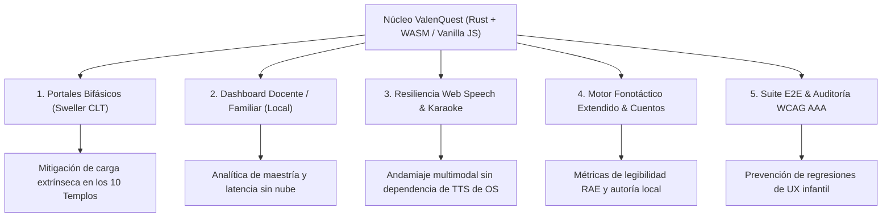

# ValenQuest: Oportunidades, Sugerencias y Hoja de Ruta de Evolución Técnica

Este documento técnico consolida el diagnóstico de madurez de **ValenQuest (KidsLearn-WASM)**, identifica las oportunidades estratégicas de mejora en sus capas de software y pedagogía, y establece una hoja de ruta estructurada para guiar las siguientes fases de desarrollo.

---

## 1. Diagnóstico del Estado Actual y Principios Rectores

ValenQuest destaca por una base de ingeniería sólida y disciplinada, poco común en aplicaciones de tecnología educativa (*EdTech*):
* **Cómputo determinista y de alto rendimiento:** Lógica adaptativa EMA, silabeo fonotáctico RAE y FSM de 10 tiers curriculares encapsulados en Rust (`wasm32-unknown-unknown`).
* **Frontend Zero-Framework:** Presentación ultra-liviana en Vanilla JavaScript (ES Modules) y CSS nativo modular, eliminando sobrecargas de empaquetadores, dependencias reactivas y vulnerabilidades de la cadena de suministro.
* **Privacidad y autonomía local-first:** Cero telemetría externa, persistencia en `IndexedDB` transaccional, audio procedural sintetizado vía `Web Audio API` y funcionamiento offline garantizado mediante Service Worker.

Cualquier evolución o nueva funcionalidad propuesta en esta especificación **debe respetar estrictamente estos principios fundacionales**, garantizando que el peso del binario, la privacidad del menor y la velocidad de respuesta sigan siendo óptimos.

---

## 2. Oportunidades Estratégicas y Propuestas Técnicas



---

### 2.1. Oportunidad 1: Integración de la Arquitectura Bifásica de Portales (Mitigación Sweller CLT)

#### Contexto y Justificación
El prototipo implementado en `www/palacio-prisma.html` demostró el beneficio pedagógico de la **Teoría de Carga Cognitiva de Sweller (CLT)**. En los desafíos de portal convencionales, presentar simultáneamente la narrativa del guardián, las instrucciones del acertijo y las opciones numéricas satura la memoria de trabajo de niños de 5 a 9 años.

#### Propuesta de Implementación
Unificar el flujo de los 10 templos astrales en un modelo bifásico coordinado entre Rust y JavaScript:

1. **Fase 1: Asimilación Visual y Semántica (Storytelling & Scaffolding):**
   * El guardián astral y la heroína activa introducen el dilema en un entorno libre de presión numérica.
   * La heroína ofrece una pista conceptual o andamiaje visual (p. ej., agrupaciones de gemas o sinónimos contextuales).
2. **Fase 2: Ejecución y Purificación (Active Mastery Execution):**
   * Transición fluida con animación pastel (`vq-anim-portal-open`).
   * Despliegue del reto numérico interactivo con distractores plausibles generados por el PRNG `Xorshift64`.
   * Feedback háptico/sonoro inmediato y purificación astral tras la resolución.

```text
src/engine/
├── math_fsm.rs          # Añadir PortalChallengeState con phase: 1 | 2
└── tests/
    └── portal_tests.rs  # Validación de transiciones de fase y sembrado
```

---

### 2.2. Oportunidad 2: Panel de Acompañamiento Docente y Familiar (Dashboard Local-First)

#### Contexto y Justificación
`IndexedDB` almacena un registro exhaustivo de cada intento: tiempos de latencia cognitiva, racha actual, respuestas erróneas consecutivas y valor de maestría EMA ($M_k$). Sin embargo, actualmente estos datos son invisibles para tutores y docentes, desaprovechando una herramienta clave para la detección temprana de dificultades de aprendizaje (como confusión en acarreos o dislexia silábica).

#### Propuesta de Implementación
Crear una vista dedicada accesible mediante un gesto o PIN parental simple (p. ej., resolver una multiplicación mental de desbloqueo):

* **Matriz de Dominio Curricular:**
  * Representación visual del estado en las *Diez Lunas* (Nivel 1 al 10), señalando si el estudiante se encuentra en fase de exploración ($M_k < 0.65$), consolidación ($0.65 \le M_k < 0.95$) o maestría ($M_k \ge 0.95$).
* **Curva de Aprendizaje Temporal (Sin librerías externas):**
  * Gráfico vectorial SVG ultra-ligero generado procedimentalmente desde JS, mostrando la evolución de la latencia cognitiva ponderada ($P$) a lo largo de las últimas 30 sesiones.
* **Diagnóstico de Patrones de Error:**
  * Detección algorítmica de distractores recurrentes (p. ej., fallos reiterados en restas con reagrupación vs. sumas directas).
* **Portabilidad de Datos Soberana:**
  * Botones para **Exportar Historial (JSON cifrado/ofuscado localmente)** e **Importar Progreso**, permitiendo migrar el avance de una tableta escolar a una computadora hogareña sin requerir cuentas ni servidores remotos.

---

### 2.3. Oportunidad 3: Resiliencia y Modo "Karaoke Visual Asistido" para Síntesis de Voz

#### Contexto y Justificación
La `Web Speech API` (`speechSynthesis`) depende de las voces instaladas en el sistema operativo del cliente. En ciertos dispositivos Android de gama de entrada o entornos escolares con navegadores restringidos, las voces en español de calidad infantil pueden no estar disponibles offline o fallar silenciosamente.

#### Propuesta de Implementación
Reforzar `www/js/speech.js` con un sistema de contingencia multicapa:

1. **Inspección Heurística de Voces:**
   * Priorizar dialectos en español en el siguiente orden: `es-419` (latinoamericano neutro) $\rightarrow$ `es-MX` $\rightarrow$ `es-ES` $\rightarrow$ `es-US` $\rightarrow$ genérica `es`.
2. **Modo "Karaoke Visual Asistido" (Fallback Activo):**
   * Si `window.speechSynthesis` no está disponible o no emite el evento `start` en $\le 300\text{ ms}$, la UI activa el modo visual sustitutivo:
     * El texto del micro-cuento o la consigna se descompone en palabras o sílabas mediante `reading.rs` de WASM.
     * Un cursor luminoso o subrayado dorado (`.vq-karaoke-word-active`) recorre el texto a una velocidad calculada a partir del WPM ideal para el nivel del niño (80–120 palabras por minuto).
3. **Indicador Visual de Estado Auditivo:**
   * Indicador en el botón de audio (`#btn-toggle-speech`) que informe discretamente al usuario si el audio hablado está disponible o si opera en modo de lectura visual asistida.

---

### 2.4. Oportunidad 4: Expansión del Motor Fonotáctico y Creador Abierto de Cuentos

#### Contexto y Justificación
El parser fonotáctico en `src/engine/reading.rs` es una de las piezas más sofisticadas del proyecto, implementando reglas rigurosas de la RAE para división silábica, diptongos, triptongos e hiatos. Actualmente, los textos de lectura están codificados estáticamente en el repositorio.

#### Propuesta de Implementación
1. **Cálculo de Legibilidad en Rust:**
   * Implementar en WebAssembly la fórmula de **Fernández-Huerta** o **Gutiérrez de Polini** (adaptaciones del índice de Flesch para el idioma español):
     $$\text{IFH} = 206.84 - (0.60 \cdot P) - (1.02 \cdot F)$$
     *(donde $P$ es el número de sílabas por cada 100 palabras y $F$ es el número de frases por cada 100 palabras).*
   * Clasificar automáticamente la dificultad de cualquier texto en escala primaria (Muy Fácil, Fácil, Normal, Complejo).
2. **Esquema de Autoría Abierta (Custom Tales Schema):**
   * Definir una especificación JSON para que educadores o padres puedan añadir pasajes de lectura propios validados por WASM:
     ```json
     {
       "id": 101,
       "title": "El Misterio de la Estrella Azul",
       "tier": 3,
       "text": "Valen y Reni volaron sobre el río de perlas...",
       "questions": [
         {
           "question": "¿Quién acompañó a Valen?",
           "options": ["Reni", "Zoe", "Lía"],
           "correct_index": 0
         }
       ]
     }
     ```

---

### 2.5. Oportunidad 5: Suite Automatizada de Pruebas E2E y Verificación de Accesibilidad

#### Contexto y Justificación
Aunque la cobertura de pruebas unitarias en Rust es ejemplar (19 pruebas superadas sin fallos en `math_tests`), la capa de interfaz de usuario en Vanilla JS y los contratos DOM no cuentan con un pipeline automatizado de integración continua que valide:
* Navegación por teclado virtual en pantallas de diferentes tamaños.
* Contraste cromático estricto bajo el tema Día Pastel y Noche Astral (WCAG AAA).
* Comportamiento del Service Worker tras actualizaciones sucesivas de versión de caché.

#### Propuesta de Implementación
* Integrar pruebas *headless* ultra-ligeras con **Playwright** en el pipeline existente de GitHub Actions y GitLab CI (`.gitlab-ci.yml`):
  * Verificación de renderizado y áreas táctiles de $\ge 48\times48\text{ px}$.
  * Validación de la no aparición de errores de consola durante la inicialización de IndexedDB y carga de WASM.
  * Auditoría automatizada de accesibilidad con `@axe-core/playwright`.

---

## 3. Matriz de Priorización y Cronograma de Implementación

Para asegurar un desarrollo ordenado que no comprometa la estabilidad del entorno productivo, las iniciativas se organizan en tres horizontes temporales:

| Fase | Iniciativa | Impacto Pedagógico | Complejidad Técnica | Dependencias Clave |
| :--- | :--- | :---: | :---: | :--- |
| **Fase 1 (Corto Plazo)** | **Integración Bifásica de Portales** | Muy Alto | Media | `palacio-prisma.html`, `levels-data.js` |
| **Fase 1 (Corto Plazo)** | **Resiliencia de Voz y Karaoke Visual** | Alto | Baja | `www/js/speech.js`, `reading.rs` |
| **Fase 2 (Mediano Plazo)**| **Dashboard Familiar/Docente Local** | Muy Alto | Media | `storage.js` (`IndexedDB` v4), CSS Nativo |
| **Fase 2 (Mediano Plazo)**| **Suite E2E & Auditoría WCAG AAA** | Alto | Media | GitHub Actions, `.gitlab-ci.yml` |
| **Fase 3 (Largo Plazo)** | **Índice de Legibilidad RAE en WASM** | Medio | Alta | `src/engine/reading.rs` |
| **Fase 3 (Largo Plazo)** | **Módulo de Autoría de Cuentos JSON** | Alto | Media | Esquema serde en Rust + Interfaz UI |

---

## 4. Conclusión y Recomendación Estratégica

ValenQuest posee una ventaja competitiva fundamental: **su arquitectura no envejece con la volatilidad de los frameworks frontend**. Al mantener el cómputo en Rust/WASM y la interfaz en tecnologías web estándares, el producto garantiza una longevidad operativa de muchos años con mantenimiento mínimo y rendimiento instantáneo.

La priorización inmediata debe enfocarse en **trasladar el prototipo bifásico de `palacio-prisma.html` a la aplicación principal** y **desplegar el panel de progreso local**, transformando los datos invisibles de maestría en valor formativo tangible para las familias y los docentes.
