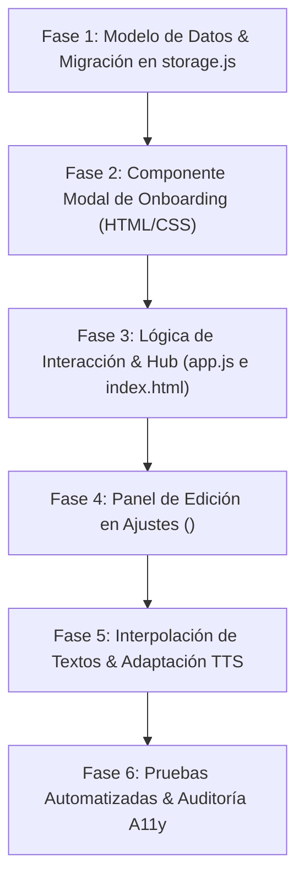

# 📜 Plan de Integración: Credencial del Aventurero & Onboarding de Perfil Infantil

**Proyecto:** ValenQuest 🦄✨  
**Estado:** 🟢 Implementado & Verificado (Egg RFC-001)  
**Versión Base:** v2.1.10  
**Fecha:** 2026-09-25  

---

## 1. Resumen Ejecutivo y Visión Pedagógica

Actualmente, el perfil del jugador en ValenQuest inicializa por defecto el nombre estático `"Valen"` y asume un tratamiento gramatical femenino generalizado (*"Bienvenida"*, *"preparada"*, etc.).

La implementación de este módulo introduce la **«Credencial de Aventurero de Lumiria»**: una experiencia de bienvenida inmersiva y lúdica en la primera visita que solicita:
1. **Nombre o Apodo**: Cómo le gusta al niño/a ser llamado.
2. **Identidad / Tratamiento Gramatical**: Niño (*Explorador*), Niña (*Exploradora*) o Aventurero Estelar (*Neutral*).
3. **Edad**: Selección táctil en botones grandes (de 4 a 11+ años).

### 🎯 Impacto y Beneficios Pedagógicos
* **Pertenencia y Motivación Intrínseca**: Ver su propio nombre en los diálogos de las princesas, en el salón principal y en las cartas de victoria de los templos multiplica el compromiso del menor con la práctica diaria.
* **Concordancia Gramatical Natural**: Respeta la identidad del menor adaptando los mensajes de felicitación, racha y bienvenida sin forzar una concordancia discordante.
* **Calibración Adaptativa por Edad**:
  * **Sugerencia de nivel inicial**: Recomienda un punto de partida acorde a su etapa escolar (ej. 5-6 años $\rightarrow$ Nivel 1; 7-8 años $\rightarrow$ Nivel 3; 9-10 años $\rightarrow$ Nivel 5+), manteniendo siempre la libertad de elegir cualquier nivel.
  * **Cadencia del Sintetizador de Voz (TTS)**: Para edades de 4-6 años, el ritmo de locución se ajusta automáticamente a un tempo más pausado (`rate: 0.85`), mientras que para mayores de 7 años utiliza el tempo estándar (`1.0`).
* **Privacidad Infantil Garantizada (Local-First)**: Sin cuentas, sin contraseñas, sin servidores externos. La información vive 100% en el dispositivo (`IndexedDB`), cumpliendo de manera estricta las directivas COPPA y GDPR-K.

---

## 2. Experiencia de Usuario (UX/UI Infantil)

### 2.1. Concepto Lúdico: «La Credencial de Lumiria»
Para evitar que el niño sienta que está completando un trámite burocrático, la pantalla se modela como un **rito de iniciación mágica**:

```
┌──────────────────────────────────────────────────────────────────┐
│                   🌟 ¡Bienvenido a Lumiria! 🌟                   │
│         Las cuatro princesas preparan tu pergamino real          │
├──────────────────────────────────────────────────────────────────┤
│                                                                  │
│  🪄 ¿Cómo te gusta que te llamen?                                │
│     ┌──────────────────────────────────────────────────────────┐ │
│     │ Escribe tu nombre o apodo mágico...                      │ │
│     └──────────────────────────────────────────────────────────┘ │
│                                                                  │
│  ✨ ¿Cómo quieres que te llamemos en el reino?                   │
│     ┌─────────────────────┐   ┌─────────────────────┐            │
│     │  🛡️ Explorador (Él)  │   │ 👑 Exploradora (Ella)│            │
│     └─────────────────────┘   └─────────────────────┘            │
│                 ┌───────────────────────┐                        │
│                 │ ✨ Aventurero Estelar │                        │
│                 └───────────────────────┘                        │
│                                                                  │
│  🎂 ¿Cuántos soles (años) tienes?                                │
│     ┌───┐ ┌───┐ ┌───┐ ┌───┐ ┌───┐ ┌───┐ ┌────┐                   │
│     │ 5 │ │ 6 │ │ 7 │ │ 8 │ │ 9 │ │10 │ │ 11+│                   │
│     └───┘ └───┘ └───┘ └───┘ └───┘ └───┘ └────┘                   │
│                                                                  │
│            [ 🚀 ¡Comenzar mi Viaje Mágico! 🌟 ]                  │
│                                                                  │
└──────────────────────────────────────────────────────────────────┘
```

### 2.2. Ergonomía Táctil y Accesibilidad (WCAG 2.2 AA)
* **Blancos Táctiles Generosos**: Botones de edad y género con altura mínima de $\ge 52\text{px}$ y separación de $8\text{px}$ para evitar pulsaciones accidentales (*fat-finger proof*).
* **Teclado Virtual Seguro**: El campo de texto utiliza `autocomplete="nickname"` y `maxlength="20"`, con botón visual para borrar texto y soporte de foco `:focus-visible`.
* **Soporte de Voz Accesible**: Botón TTS opcional para que la app lea en voz alta las preguntas si el niño aún está aprendiendo a leer.
* **Tema Día / Noche**: Integrado con los tokens visuales `--vq-paper-fill`, `--vq-ink-line` y paleta pastel de Lumiria.

---

## 3. Modelo de Datos y Persistencia

### 3.1. Extensión del Almacén `player_profile` (`storage.js`)
El esquema de `IndexedDB` (`valenquest_db`) se extiende de manera retrocompatible:

```typescript
interface PlayerProfile {
  id: 'active';
  name: string;                   // Nombre o apodo (ej. "Sofía", "Mateo", "Valen")
  gender: 'girl' | 'boy' | 'neutral'; // Tratamiento preferido
  age: number;                    // Edad (4 a 12)
  onboardingCompleted: boolean;   // true una vez guardada la credencial inicial
  
  // Atributos existentes conservados íntegros:
  avatar: string;
  stars: number;
  diamonds: number;
  selectedCompanion: string;
  theme: 'light' | 'dark';
  currentTier: number;
  mathTier: number;
  readingTier: number;
  bestStreak: number;
  currentStreak: number;
  lastPlayed: string;
}
```

### 3.2. Migración Silenciosa
* Si el perfil existente no cuenta con `onboardingCompleted`:
  * En usuarios que ya tienen progreso (`stars > 5` o `currentTier > 1`), se marca `onboardingCompleted = true` para **no interrumpir** su juego, asignando valores por defecto (`gender: 'girl'`, `name: 'Valen'`, `age: 7`).
  * En nuevos usuarios (`stars === 5` e inicio limpio), se dispara el modal de bienvenida en su primera entrada.
  * Siempre se podrá modificar o afinar estos datos en la pantalla de **Ajustes Mágicos**.

---

## 4. Sistema de Tratamiento y Concordancia Dinámica

Se introduce una utilidad ligera de localización e interpolación de texto:

```javascript
// Ejemplo conceptual: helper de concordancia
export function getPlayerTitle(profile) {
  switch (profile.gender) {
    case 'boy':
      return { welcome: '¡Bienvenido!', explorer: 'Explorador', champion: 'Campeón', ready: 'preparado' };
    case 'neutral':
      return { welcome: '¡Te damos la bienvenida!', explorer: 'Aventurero', champion: 'Gran Guía', ready: 'con todo listo' };
    case 'girl':
    default:
      return { welcome: '¡Bienvenida!', explorer: 'Exploradora', champion: 'Campeona', ready: 'preparada' };
  }
}
```

### Puntos Clave de Personalización en la App:
1. **Hub Principal (`index.html`)**:
   `¡Bienvenido/a a tu Aventura en Lumiria, ${profile.name}!`
2. **Saludos de las Heroínas (`companions.js`)**:
   `«¡Hola, ${profile.name}! Siente la brisa fresca...»`
3. **Desafíos de Portal y Diplomas de Templo (`portal-controller.js` / `campaign-arena.js`)**:
   `«¡El Templo del Manantial ha sido purificado por ${profile.name}, valiente ${title.explorer}!»`

---

## 5. Plan de Integración por Fases



### 📅 Desglose de Fases de Trabajo:

#### 🔹 Fase 1: Capa de Almacenamiento y Servicios (`storage.js`)
- [x] Incorporar campos `name`, `gender`, `age` y `onboardingCompleted` en `ensureSeedData()` y `getProfile()`.
- [x] Migración 1g retrocompatible para preservar partidas previas sin interrumpir usuarios activos.
- [x] Crear métodos dedicados: `db.isOnboardingNeeded()` y `db.savePlayerIdentity({ name, gender, age, selectedCompanion })`.
- [x] Sanitización robusta ante entradas malformadas (recorte de nombre, redondeo de edad, género seguro).
- [x] Smoke test automatizado en Node (`scripts/smoke-profile-storage.mjs` y `npm run test:profile`).

#### 🔹 Fase 2: Componente Visual y Estilos (`components.css` / `index.html`)
- [x] Diseñar el markup accesible del modal `#onboarding-modal` con rol `dialog`, `aria-labelledby` y `aria-modal="true"`.
- [x] Estilizar el pergamino mágico con bordes redondeados, selector de apodos rápidos táctiles y blancos táctiles $\ge 48\text{px}$.
- [x] Rejilla de género táctil (3 opciones) con SVG stickers y selector de edad en burbujas táctiles (5 a 10+).
- [x] Selector de compañera guía inicial con los 4 avatares de heroínas de Lumiria.
- [x] Compatibilidad total con tema claro y modo noche astral (`[data-theme="dark"]`).

#### 🔹 Fase 3: Lógica del Onboarding y Edición en Ajustes (`app.js` y `header.js`)
- [x] Al inicializar `KidsLearnApp.init()`, verificar si `!profile.onboardingCompleted` y desplegar `#onboarding-modal`.
- [x] Validar y sanitizar campo de nombre, apodos rápidos y botones táctiles de género/edad/compañera.
- [x] Al firmar el pergamino, guardar en DB con `db.savePlayerIdentity`, activar compañera, reproducir sonido de victoria y cerrar modal.
- [x] Agregar grupo *"Perfil del Aventurero"* en el modal de Ajustes mágicos de `<vq-header>` para edición posterior de nombre, tratamiento y edad.
- [x] Disparar evento global `vq-profile-updated` para sincronizar cualquier componente en vivo sin recargar la página.

#### 🔹 Fase 4: Textos Dinámicos, Concordancia y Ajuste TTS por Edad
- [x] Crear módulo de utilidades de formato [`profile-format.js`](../www/js/services/profile-format.js) con las variantes gramaticales (`getPlayerTitle`, `getWelcomeHeadlineHtml`, `getPersonalizedVoiceGreeting`).
- [x] Conectar la edad seleccionada con la velocidad de voz en [`speech.js`](../www/js/services/speech.js) (`calibrateRateForAge(age)`: ritmo pausado 0.85 para $\le 6$ años, normal 1.0 para $\ge 7$).
- [x] Personalizar dinámicamente el título del salón principal en `index.html` e interpolar el nombre del niño resaltado.
- [x] Saludo de voz personalizado por la princesa activa al firmar el pergamino.

#### 🔹 Fase 5: Pruebas, Control de Calidad y No-Regresión
- [x] Smoke test automatizado en Node ([`scripts/smoke-profile-storage.mjs`](../scripts/smoke-profile-storage.mjs)) cubriendo storage, sanitización, concordancia de género y calibración TTS (`npm run test:profile`).
- [x] Suite completa de tests de Rust ([`cargo test`](../Cargo.toml)) y smoke tests existentes ejecutados con 100% de éxito (35 tests Rust + smoke campaña + smoke contenido).
- [x] Accesibilidad (WCAG 2.2 AA, navegación por teclado, foco `:focus-visible` y Escape en modales).
- [x] Verificación de versionado sin deriva contra SSOT (`npm run version:check`).

---

## 6. Consideraciones y Guardrails de Seguridad
1. **Sin Almacenamiento de Apellidos ni Datos Sensibles**: El campo solicita expresamente *"Nombre o apodo mágico"*.
2. **Cero Dependencias de Red**: Toda la funcionalidad debe operar de manera offline y autónoma en Service Worker.
3. **Resistencia a Fallos**: Si el usuario cierra el modal o no introduce un nombre, el sistema recurrirá a valores amigables por defecto (`"Aventurero"`, `edad: 7`).
